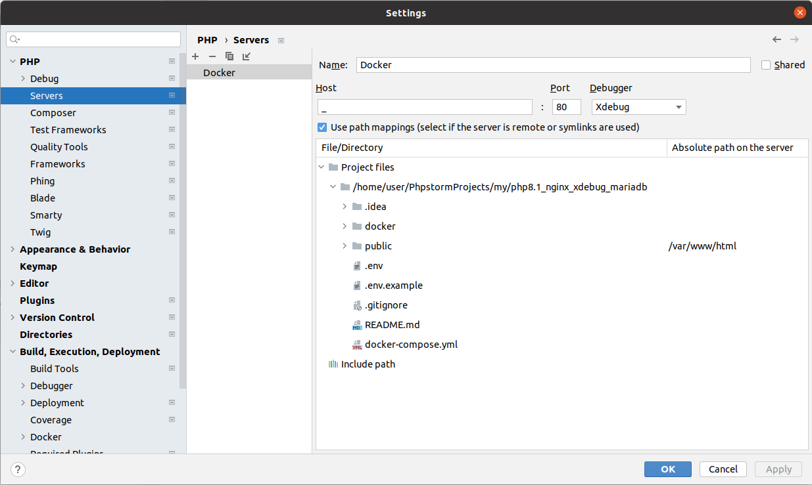
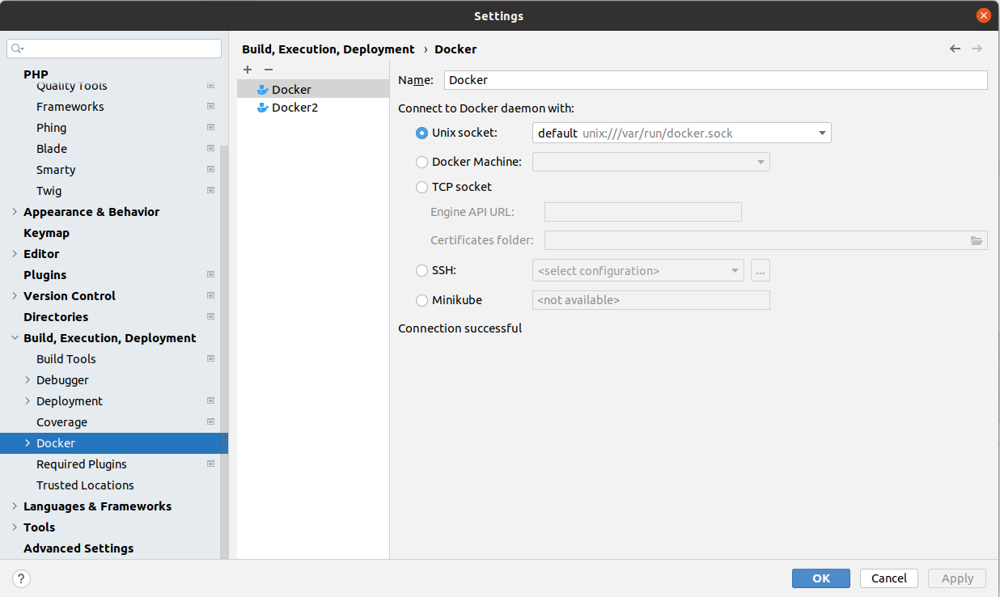

# PHP 8.1 & Nginx & Xdebug 3 & MariaDB & Composer

### Build
> docker-compose up -d --build

### Start
> docker-compose up -d

### Stop
> docker-compose down

### View PHP version
> docker-compose exec php-fpm php -v

## PhpStorm xdebug settings

